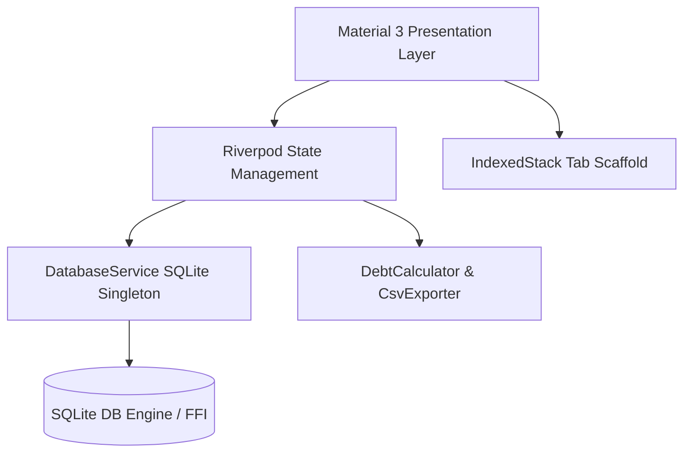

# Comprehensive System Specification: FirmLedger

**Specification ID**: `SPEC-001`  
**System Name**: FirmLedger (Expense & Debt Manager)  
**Version**: `1.0.0`  
**Target Platforms**: Linux Desktop (x86_64 native GTK), Android, iOS, Windows, macOS  
**Architecture**: Offline-First Local Storage, Reactive State Management (Flutter Riverpod), Native Rendering (Flutter/Material 3)

---

## 1. Executive Summary & Purpose

FirmLedger is an offline-first financial and debt management application engineered for small businesses, independent consultancies, and sole proprietors. It solves three critical operational problems:
1. **Cash Flow Visibility**: Tracking real-time revenue inflows, operating expense outflows, and category budgets.
2. **Counterparty Credit & Debt Tracking**: Managing bilateral liabilities (debts owed by the firm) and assets (receivables owed to the firm by clients/borrowers).
3. **Strategic Debt Payoff**: Algorithmic simulation of payoff timelines using **Snowball** and **Avalanche** methods with extra monthly debt allocations.

All data remains 100% on-device within local SQLite storage, eliminating external cloud exposure for sensitive business accounting.

---

## 2. System Architecture & Tech Stack



### 2.1 Core Dependencies
* **Flutter SDK**: `>=3.3.0 <4.0.0` (Material 3 enabled)
* **State Management**: `flutter_riverpod: ^2.6.1`
* **Local Persistence**: `sqflite: ^2.4.2` / `sqflite_common_ffi: ^2.3.7+1`
* **Data Visualization**: `fl_chart: ^0.68.0` (isolated via `RepaintBoundary`)
* **Formatting & Utilities**: `intl: ^0.19.0`, `uuid: ^4.5.1`

---

## 3. Domain Entities & Database Schema

The database engine is version `3`, operating on local file `expense_debt_manager.db`.

### 3.1 `categories` Table
Categorization taxonomy for operating expenses and revenues with optional monthly spending limits.

| Field | SQLite Type | Constraints | Description |
| :--- | :--- | :--- | :--- |
| `id` | `TEXT` | `PRIMARY KEY` | Unique identifier (e.g. `cat_housing`) |
| `name` | `TEXT` | `NOT NULL` | Human-readable label |
| `colorHex` | `INTEGER` | `NOT NULL` | ARGB color integer |
| `budgetLimit`| `REAL` | `NOT NULL` | Monthly spending cap |

### 3.2 `transactions` Table
Inflows and outflows with counterparty and payment classification.

| Field | SQLite Type | Constraints | Description |
| :--- | :--- | :--- | :--- |
| `id` | `TEXT` | `PRIMARY KEY` | UUID v4 |
| `title` | `TEXT` | `NOT NULL` | Product / Service item description |
| `amount` | `REAL` | `NOT NULL, > 0` | Numerical financial value |
| `type` | `TEXT` | `NOT NULL` | `income` or `expense` |
| `incomeType` | `TEXT` | `NULL` | `goods`, `service`, or `other` |
| `paymentMethod` | `TEXT` | `NOT NULL` | `bank`, `cash`, or `credit` |
| `partyName` | `TEXT` | `NULL` | Customer, client, or supplier name |
| `categoryId` | `TEXT` | `NOT NULL` | Foreign key referencing `categories.id` |
| `date` | `TEXT` | `NOT NULL` | ISO 8601 formatted timestamp |
| `notes` | `TEXT` | `NULL` | Additional memo / details |

* **Indices**: `idx_transactions_date ON transactions(date)`, `idx_transactions_category ON transactions(categoryId)`

### 3.3 `debts` Table
Bilateral ledger tracking liabilities and receivables.

| Field | SQLite Type | Constraints | Description |
| :--- | :--- | :--- | :--- |
| `id` | `TEXT` | `PRIMARY KEY` | UUID v4 |
| `title` | `TEXT` | `NOT NULL` | Description or loan title |
| `partyName` | `TEXT` | `NOT NULL` | Counterparty (Lender or Borrower) |
| `isOwedByMe`| `INTEGER` | `NOT NULL (0 or 1)` | `1` = Liability (I owe), `0` = Receivable (Owed to me) |
| `originalAmount` | `REAL` | `NOT NULL` | Principal amount at issuance |
| `currentBalance` | `REAL` | `NOT NULL, >= 0`| Remaining outstanding balance |
| `apr` | `REAL` | `NOT NULL, >= 0`| Annual percentage interest rate |
| `minMonthlyPayment` | `REAL` | `NOT NULL, >= 0`| Minimum contractual payment |
| `dueDate` | `TEXT` | `NOT NULL` | ISO 8601 repayment deadline |
| `notes` | `TEXT` | `NULL` | Additional debt notes |

* **Indices**: `idx_debts_owed ON debts(isOwedByMe)`

### 3.4 `debt_payments` Table
Historical audit trail of repayments against tracked debts.

| Field | SQLite Type | Constraints | Description |
| :--- | :--- | :--- | :--- |
| `id` | `TEXT` | `PRIMARY KEY` | Millisecond timestamp ID |
| `debtId` | `TEXT` | `NOT NULL` | References `debts.id` |
| `amount` | `REAL` | `NOT NULL, > 0` | Repayment amount |
| `date` | `TEXT` | `NOT NULL` | ISO 8601 timestamp |
| `notes` | `TEXT` | `NULL` | Optional memo |

---

## 4. Functional Requirements & User Stories

### 4.1 Dashboard & Financial Analytics
* **US-1.1: Financial KPI Metric Cards**: The system shall compute and display Total Income, Total Expenses, Receivables (Money to Collect), and Payables (Money Due).
* **US-1.2: Date-Range Filtering**: Users shall be able to filter the dashboard by custom date ranges. All calculations and detail modals must strictly reflect only records inside the specified period.
* **US-1.3: Net Worth & Debt-To-Income (DTI)**:
  $$\text{Net Worth} = (\text{Total Income} - \text{Total Expenses} + \text{Receivables}) - \text{Payables}$$
  $$\text{DTI} = \left(\frac{\text{Total Payables}}{\text{Total Income}}\right) \times 100\%$$
* **US-1.4: Visual Breakdown Charts**:
  * **Income vs Expense**: Pie chart with percentage shares.
  * **Receivables vs Payables**: Side-by-side bar comparison.

### 4.2 Transaction Inflow & Outflow Management
* **US-2.1: Transaction Entry Validation**:
  * Mandatory item name, positive amount ($> 0$), date, and payment method.
  * When `paymentMethod == credit`, counterparty `partyName` is strictly required.
  * Selecting `Expense` requires selecting an Expense Category.
  * Selecting `Income` automatically links to the Salary/Revenue category.
* **US-2.2: Automated Credit Debt Creation**:
  * If a transaction is submitted with payment method `credit`, the system automatically inserts a linked record in `debts`.
  * If `Income (Credit)` &rarr; creates a Receivable (`isOwedByMe = 0`).
  * If `Expense (Credit)` &rarr; creates a Payable liability (`isOwedByMe = 1`).
* **US-2.3: Transaction Exploration & Filtering**: Real-time text search across item title and party names, combined with quick filter chips (`All`, `Income`, `Expense`, `Credit`, `Cash`).
* **US-2.4: Dismissible Deletion**: Swipe-to-delete gesture removes transactions from local storage with immediate UI state update.

### 4.3 Debt & Payoff Strategy Simulator
* **US-3.1: Bilateral Debt Tracking**: Distinct segregation between Payables (liabilities) and Receivables (assets).
* **US-3.2: Partial & Full Repayments**: Logging a repayment reduces `currentBalance` (clamped at $0.00$) and records an entry in `debt_payments`.
* **US-3.3: Algorithmic Payoff Simulator (`DebtCalculator`)**:
  * **Snowball Strategy**: Prioritizes debt with the lowest current balance first for psychological momentum.
  * **Avalanche Strategy**: Prioritizes debt with the highest APR first for interest cost minimization.
  * Dynamic monthly extra budget slider ($0 - $1,000) recalculating total months to debt freedom and total interest accrued.

### 4.4 Reporting & Export
* **US-4.1: CSV Statement Generation**: Generates compliant RFC-4180 CSV exports containing firm metadata (Firm Name, Tax ID, Reporting Period) and records strictly bounded by the user-selected date range.

---

## 5. Non-Functional & Performance Requirements

* **NFR-1 (Resource Footprint)**: Release desktop binary must run within $\le 50\text{ MB}$ initial resident memory, maintaining $\le 2\%$ CPU utilization during idle states.
* **NFR-2 (Render Performance)**: Heavy chart widgets (`PieChart`, `BarChart`) must be encapsulated within `RepaintBoundary` widgets with `swapAnimationDuration: Duration.zero` to prevent unnecessary raster repainting during window scrolling.
* **NFR-3 (State Preservation)**: Main view navigation uses `IndexedStack` to preserve scroll offsets and prevent state disposal during tab switching.
* **NFR-4 (Lookup Complexity)**: Category lookups in transaction lists must be pre-indexed into a hash map to guarantee $O(1)$ item resolution time.
* **NFR-5 (Offline Security)**: Zero network calls, zero external analytics, and complete local database sandboxing.

---

## 6. Acceptance Criteria (Gherkin Scenarios)

```gherkin
Feature: Automated Debt Entry on Credit Transaction
  Scenario: Adding a credit sale creates a customer receivable
    Given the user is on the New Transaction screen
    When the user enters Title "Wholesale Grain", Amount 15000, Type "Income"
    And selects Payment Method "Credit" with Party Name "Annapurna Traders"
    And taps Submit
    Then a transaction of 15000 is created
    And a debt record titled "Wholesale Grain (Credit)" is created
    And the debt has isOwedByMe set to false
    And the debt currentBalance is 15000

Feature: Statement Export Date Bounding
  Scenario: Exporting CSV only includes transactions within date range
    Given transactions exist for January 2026 and August 2026
    When the user exports CSV statement with date range 2026-08-01 to 2026-08-31
    Then the exported CSV contains records from August 2026
    And the exported CSV does not contain records from January 2026

Feature: Debt Payoff Simulation
  Scenario: Snowball orders lowest balance first
    Given active debts "Card A" with balance 1000 and "Loan B" with balance 8000
    When the Snowball payoff simulation is executed
    Then "Card A" is the first debt in payoffOrder
```

---

## 7. Verification Matrix

| Spec ID | Module | Automated Test File | Status |
| :--- | :--- | :--- | :--- |
| `SPEC-001.1` | Model Serialization & Invariants | `test/models_test.dart` | ✅ Passing |
| `SPEC-001.2` | Payoff Strategies (Snowball/Avalanche) | `test/debt_calculator_test.dart` | ✅ Passing |
| `SPEC-001.3` | Statement Export Date Filtering | `test/csv_exporter_test.dart` | ✅ Passing |
| `SPEC-001.4` | Currency & Date Formatters | `test/formatters_test.dart` | ✅ Passing |
| `SPEC-001.5` | Application Smoke & Engine Bootstrap | `test/widget_test.dart` | ✅ Passing |
| `SPEC-001.6` | Static Code Quality & Lints | `flutter analyze` | ✅ 0 Issues |
