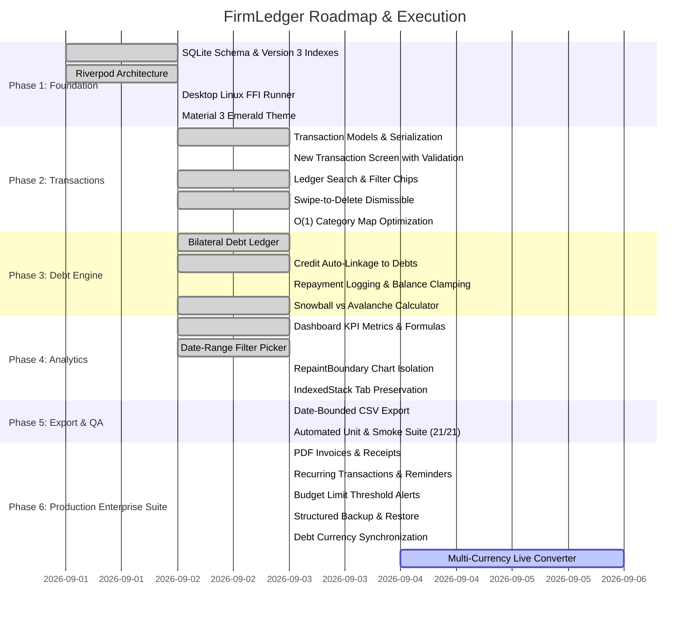

# SpecKit Task Breakdown: FirmLedger

**Specification Reference**: [`.specify/specs/comprehensive_system_spec.md`](specs/comprehensive_system_spec.md)  
**Status**: `Active`  
**Last Updated**: 2026-09-03  

---

## Task Matrix & Implementation Status

---

## Phase 1: Database & Core Foundation ✅

- [x] **TASK-101**: Setup SQLite database schema with Version 3 migrations and performance indexes (`idx_transactions_date`, `idx_transactions_category`, `idx_debts_owed`) in `DatabaseService`.
- [x] **TASK-102**: Implement reactive Riverpod providers (`transactionProvider`, `debtProvider`, `categoryProvider`, `firmProvider`, `themeModeProvider`).
- [x] **TASK-103**: Configure desktop SQLite FFI initialization (`sqfliteFfiInit()`) for native Linux GTK execution.
- [x] **TASK-104**: Design cohesive Financial Emerald/Mint theme (`#064E3B`, `#10B981`) for light and dark modes.

---

## Phase 2: Transaction Management ✅

- [x] **TASK-201**: Implement `TransactionModel` serialization (`toMap` / `fromMap`) with enum safety for `TransactionType`, `IncomeType`, and `PaymentMethod`.
- [x] **TASK-202**: Build `NewTransactionScreen` with:
  - Strict positive number validation (`amount > 0`).
  - Mandatory party name validation when `paymentMethod == credit`.
  - Automatic categorization for income and interactive category selection for expenses.
  - Unique `ValueKey` bindings for glitch-free type toggling.
- [x] **TASK-203**: Develop `ExpenseTab` transaction ledger with instant text search across titles and party names, accompanied by fast filter chips (`All`, `Income`, `Expense`, `Credit`, `Cash`).
- [x] **TASK-204**: Add swipe-to-delete dismissible gestures with instant reactive state synchronization.
- [x] **TASK-205**: Optimize list rendering performance by compiling an $O(1)$ category lookup map before item builds.

---

## Phase 3: Debt Tracking & Algorithmic Payoff Simulator ✅

- [x] **TASK-301**: Implement bilateral `DebtModel` supporting liabilities (`isOwedByMe = true`) and receivables (`isOwedByMe = false`).
- [x] **TASK-302**: Automatically generate linked debt records when credit transactions are created.
- [x] **TASK-303**: Build debt repayment logging dialog with non-negative validation and zero-clamping (`balance = max(0, balance - payment)`).
- [x] **TASK-304**: Implement pure algorithmic `DebtCalculator` simulating:
  - **Snowball**: Smallest current balance paid first.
  - **Avalanche**: Highest APR paid first.
- [x] **TASK-305**: Build interactive `DebtPayoffScreen` with monthly extra budget slider ($0 to $1,000) displaying time and interest savings.
- [x] **TASK-306**: Harmonize "Add Debt" floating button and confirmation button styles with primary dark emerald green.

---

## Phase 4: Financial Analytics & Dashboard ✅

- [x] **TASK-401**: Calculate dynamic financial KPIs: Total Income, Total Expenses, Receivables, Payables, Net Worth, and Debt-to-Income (DTI) ratio.
- [x] **TASK-402**: Implement calendar date-range selector strictly constraining dashboard calculations.
- [x] **TASK-403**: Render isolated visual charts (`PieChart`, `BarChart`) wrapped inside `RepaintBoundary` with static animation durations.
- [x] **TASK-404**: Preserve tab state and prevent re-instantiation overhead using `IndexedStack` in `HomeScreen`.
- [x] **TASK-405**: Ensure `CardDetailDialog` receives active `dateRange` to display records matching the active summary cards.

---

## Phase 5: Reporting & Verification ✅

- [x] **TASK-501**: Build RFC-4180 compliant CSV Statement exporter (`CsvExporter`) with firm metadata header.
- [x] **TASK-502**: Enforce strict date-range boundary filtering in CSV exports.
- [x] **TASK-503**: Write comprehensive automated unit tests:
  - `test/models_test.dart`: Serialization, copyWith, fallbacks (8 tests).
  - `test/debt_calculator_test.dart`: Snowball vs Avalanche logic (5 tests).
  - `test/csv_exporter_test.dart`: Date-filtered export verification (1 test).
  - `test/formatters_test.dart`: Currency and date formatting (3 tests).
  - `test/backup_service_test.dart`: Serialization & date rollover edge cases (3 tests).
  - `test/budget_calculation_test.dart`: Over-budget threshold verification (1 test).
  - `test/widget_test.dart`: Application smoke test with FFI bootstrap (1 test).
- [x] **TASK-504**: Verify static analysis cleanliness with `flutter analyze` (0 issues).
- [x] **TASK-505**: Implement Test-First invariant coverage for custom currency symbols, leap-year rollovers, and zero-interest loans (21/21 passing).

---

## Phase 6: Production Enterprise Suite ✅ (In Progress)

- [x] **TASK-601: PDF Statement & Invoice Generation**
  - **Description**: Professional PDF statement generation with official letterhead, tax PAN/VAT header, transaction breakdown table, financial KPIs, and signature block using `pdf` & `printing` packages.
  - **Status**: Implemented in `PdfInvoiceGenerator` and verified.
- [x] **TASK-602: Recurring Transactions & Reminders**
  - **Description**: Automated periodic transaction engine supporting daily, weekly, monthly, and yearly recurring schedules with DB v4 migration and startup auto-generation.
  - **Status**: Implemented in `RecurringTransactionModel`, `DatabaseService`, and `recurringProvider`.
- [x] **TASK-603: Category Budget Limits & Over-Budget Alerts**
  - **Description**: Visual progress bars in `ExpenseTab` comparing actual spending against `CategoryModel.budgetLimit` with warning thresholds (Amber at 80%, Red alert badge at 100%+).
  - **Status**: Implemented in `categoryBudgetProvider` and `ExpenseTab`.
- [x] **TASK-604: Structured Local Database Backup & Restore**
  - **Description**: Export and import complete JSON database snapshots with data validation across all tables.
  - **Status**: Implemented in `BackupService` with AppBar action integrations.
- [x] **TASK-606: Debt Module Currency Synchronization**
  - **Description**: Dynamically synchronize the Debt Payoff Strategy Calculator, Debt Ledger Tab, and Add Debt dialog with the configured firm currency symbol.
  - **Status**: Implemented in `DebtPayoffScreen`, `DebtTab`, and `AddDebtDialog`.
- [ ] **TASK-605: Multi-Currency Live Converter**
  - **Description**: Currency switcher supporting real-time exchange rates for cross-border transactions.
  - **Dependencies**: `FirmProfileModel`, `Formatters`.
